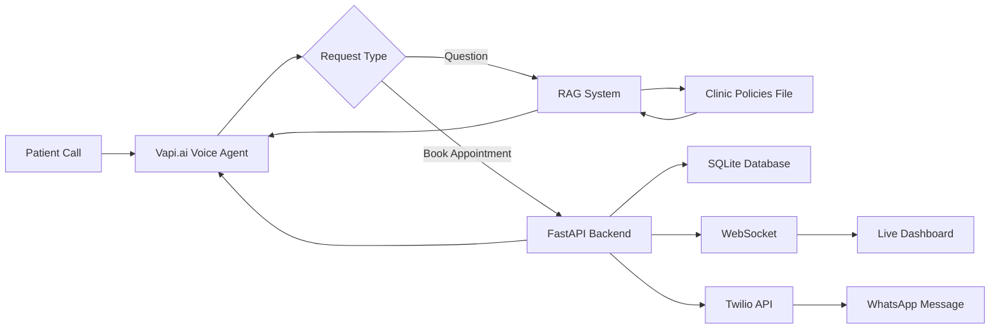

# Voice AI Medical Receptionist

## About the Project

An intelligent voice-based appointment booking system that automates the entire patient intake process. The AI receptionist handles incoming calls, answers questions about clinic policies and fees using natural language understanding, schedules appointments in real-time, and sends automatic WhatsApp confirmations to patients.

This project demonstrates practical implementation of conversational AI, real-time data synchronization, and automated communication workflows for healthcare environments.

---

## How It Works

**Simple Flow:**

1. **Patient calls** the clinic number
2. **Voice AI** (Vapi.ai) greets and collects information naturally
3. **Smart search** checks clinic policies from knowledge base to answer questions
4. **System validates** appointment availability and patient details
5. **Database stores** the booking and updates in real-time
6. **Dashboard refreshes** instantly for clinic staff (no page reload needed)
7. **WhatsApp confirmation** automatically sent to patient's phone

### System Flow Diagram



---

## Features

- **Natural Conversation:** AI understands patient requests in everyday language
- **Intelligent Answers:** Retrieves accurate information from clinic documentation using RAG technology
- **Instant Updates:** Doctor's dashboard refreshes automatically when new bookings arrive
- **Automated Notifications:** Sends WhatsApp confirmations with appointment details
- **Flexible Scheduling:** Handles date/time requests in multiple formats
- **Real-time Sync:** Multiple staff members see updates simultaneously
- **Error Handling:** Validates phone numbers, dates, and required information
- **Clean Interface:** Simple web dashboard for viewing all appointments

---

## Tech Stack

**Backend:**
- Python 3.10+
- FastAPI (Web framework)
- SQLAlchemy (Database management)
- Uvicorn (Server)

**AI & Voice:**
- Vapi.ai (Voice interface)
- Azure OpenAI (Embeddings)
- LangChain (RAG pipeline)
- FAISS (Vector search)

**Communication:**
- Twilio (WhatsApp/SMS)
- WebSockets (Real-time updates)

**Database:**
- SQLite (Development)
- PostgreSQL compatible (Production)

**Development Tools:**
- Ngrok (Local testing)
- Streamlit (Test interface)

---

## Setup and Installation

### Prerequisites

- Python 3.10 or higher installed
- API keys for: Azure OpenAI, Twilio, Vapi.ai
- Ngrok account (for local testing)

### Installation Steps

**1. Clone the repository**
```bash
git clone https://github.com/yourusername/voice-ai-medical-receptionist.git
cd voice-ai-medical-receptionist
```

**2. Create virtual environment**
```bash
python -m venv venv
venv\Scripts\activate  # On Windows
source venv/bin/activate  # On Linux/Mac
```

**3. Install dependencies**
```bash
pip install -r requirements.txt
```

**4. Configure environment variables**

Create a `.env` file in the project root:

```env
# Azure OpenAI
AZURE_OPENAI_API_KEY=your_api_key_here
AZURE_OPENAI_ENDPOINT=https://your-resource.openai.azure.com/
AZURE_OPENAI_EMBEDDING_DEPLOYMENT=text-embedding-3-small
AZURE_OPENAI_API_VERSION=2024-02-01

# Twilio
TWILIO_ACCOUNT_SID=your_account_sid_here
TWILIO_AUTH_TOKEN=your_auth_token_here
TWILIO_WHATSAPP_NUMBER=+14155238886

# Optional Settings
WHATSAPP_TEST_MODE=false
API_PORT=4444
```

**5. Run the server**
```bash
python backend.py
```

The server will start at `http://127.0.0.1:4444`

**6. Expose with Ngrok (for Vapi.ai integration)**
```bash
ngrok http 4444
```

Copy the HTTPS URL and use it in your Vapi.ai configuration.

### Access Points

- **API Documentation:** http://127.0.0.1:4444/docs
- **Live Dashboard:** http://127.0.0.1:4444/dashboard
- **Test Interface:** Run `streamlit run streamlit.py`

---

## Project Structure

```
voice-ai-medical-receptionist/
│
├── backend.py                 # Main API server
├── database.py                # Database models
├── rag_service.py             # AI question-answering system
├── whatsapp_service.py        # WhatsApp integration
├── websocket_manager.py       # Real-time updates handler
├── streamlit.py               # Testing interface
├── clear_database.py          # Database utilities
├── test_e2e.py                # End-to-end tests
├── diagnostic_test.py         # Performance tests
│
├── templates/
│   └── dashboard.html         # Live dashboard UI
│
├── faiss_index/               # Vector store (auto-generated)
├── clinic_data.txt            # Clinic information (knowledge base)
├── appointment_db.db          # SQLite database (auto-generated)
├── requirements.txt           # Python packages
├── .env                       # API credentials (create this)
└── README.md                  # Documentation
```

---

## API Endpoints

### Appointment Management

**Schedule Appointment**
```http
POST /schedule_appointments/
Content-Type: application/json

{
  "patient_name": "John Smith",
  "phone_number": "+923001234567",
  "start_time": "2026-03-20T14:30:00",
  "reason": "General Checkup"
}
```

**List Appointments**
```http
GET /list_appointments/?date=2024-03-20
```

**Cancel Appointment**
```http
POST /cancel_appointments/
Content-Type: application/json

{
  "patient_name": "John Smith",
  "date": "2024-03-20",
  "phone_number": "+923001234567"
}
```

**Ask Clinic Info (RAG)**
```http
POST /vapi/ask-clinic-info
Content-Type: application/json

{
  "query": "What are your consultation fees?"
}
```

Full API documentation available at `/docs` when server is running.

---

## Configuration for Vapi.ai

### Step 1: Server URL Configuration

1. Login to Vapi.ai Dashboard
2. Navigate to your Assistant settings
3. Find "Server URL" field
4. Paste your Ngrok HTTPS URL (e.g., `https://abc123.ngrok-free.app`)

### Step 2: Add Function Tools

**Book Appointment Function:**

```json
{
  "type": "function",
  "function": {
    "name": "bookAppointment",
    "description": "Books a medical appointment for a patient. Use this when the patient wants to schedule an appointment. Always collect name, phone number, preferred date/time, and reason for visit before calling this function.",
    "parameters": {
      "type": "object",
      "properties": {
        "patient_name": {
          "type": "string",
          "description": "Full name of the patient (e.g., 'John Doe')"
        },
        "phone_number": {
          "type": "string",
          "description": "Patient's WhatsApp phone number with country code (e.g., '+923320825825')"
        },
        "start_time": {
          "type": "string",
          "description": "Appointment date and time in ISO format (e.g., '2026-03-20T14:30:00')"
        },
        "reason": {
          "type": "string",
          "description": "Reason for the visit (e.g., 'General Checkup', 'Dental Cleaning')"
        }
      },
      "required": ["patient_name", "phone_number", "start_time", "reason"]
    }
  },
  "server": {
    "url": "https://YOUR-NGROK-URL.ngrok-free.app/schedule_appointments/",
    "timeout": 20
  }
}
```

**Ask Clinic Info Function:**

```json
{
  "type": "function",
  "function": {
    "name": "askClinicInfo",
    "description": "Retrieves information about the clinic including services, fees, doctors, timings, location, policies, and general information.",
    "parameters": {
      "type": "object",
      "properties": {
        "query": {
          "type": "string",
          "description": "The patient's question about the clinic (e.g., 'What are your consultation fees?')"
        }
      },
      "required": ["query"]
    }
  },
  "server": {
    "url": "https://YOUR-NGROK-URL.ngrok-free.app/vapi/ask-clinic-info",
    "timeout": 15
  }
}
```

### Step 3: System Prompt

Add this to your assistant's system instructions:

```
You are a professional medical receptionist at Smart Care Medical Center, a modern healthcare facility.

## Your Role:
- Warm, empathetic, and efficient
- Speak clearly and professionally
- Keep conversations concise but friendly
- Always verify information before booking

## Appointment Booking Process:

1. Greet warmly and ask for name
2. Ask for WhatsApp phone number with country code (e.g., +92-XXX or +91-XXX)
3. Check availability and ask for preferred date/time
   - Clinic hours: Monday-Friday 9 AM to 6 PM, Saturday 10 AM to 2 PM
   - Suggest slots: 9:00 AM, 11:00 AM, 2:00 PM, 4:00 PM
4. Ask for reason for visit
5. Confirm all details with patient
6. Only after confirmation, call the bookAppointment function
7. Inform patient they'll receive WhatsApp confirmation

## Information Queries:

When patients ask about doctors, services, fees, timings, or policies:
- Call the askClinicInfo function with their question
- Present information clearly
- Offer to book appointment if relevant

## Important Rules:

- NEVER book without all 4 details: name, phone, date/time, reason
- ALWAYS confirm details before calling function
- Phone numbers MUST have country code starting with '+'
- Dates must be in format: YYYY-MM-DDTHH:MM:SS
- Sound natural and human-like, not robotic
- If booking succeeds, mention WhatsApp confirmation
- For emergencies, direct to call 102 or visit ER

Remember: You represent Smart Care Medical Center. Be professional, empathetic, and efficient!
```

---

## Testing

### Manual Testing with Streamlit

1. Run the test interface:
```bash
streamlit run streamlit.py
```

2. Fill in appointment details
3. Click "Schedule Appointment"
4. Check dashboard for real-time update
5. Verify WhatsApp message received

### Automated End-to-End Tests

```bash
python test_e2e.py
```

Expected output:
```
============================================================
TEST SUMMARY
============================================================
Total Tests: 13
Passed: 13
Failed: 0
Success Rate: 100.0%
============================================================
```

### Testing with Vapi.ai

**Test Scenario 1: Complete Booking**
```
You: "Hi, I need to book an appointment"
AI: "Of course! May I have your full name please?"
You: "Sarah Johnson"
AI: "Thank you, Sarah. What's your WhatsApp phone number?"
You: "+923320825825"
AI: "Perfect. What date and time work best for you?"
You: "Tomorrow at 2 PM"
AI: "Great! And what's the reason for your visit?"
You: "General checkup"
AI: "Just to confirm: Sarah Johnson, +923320825825, tomorrow at 2 PM for general checkup. Correct?"
You: "Yes"
AI: *Books appointment* "Excellent! Your appointment is confirmed. You'll receive a WhatsApp message shortly."
```

**Test Scenario 2: Information Query**
```
You: "What are your consultation fees?"
AI: *Retrieves from knowledge base* "Our consultation fees are..."
```

---

##  Database Schema

```sql
CREATE TABLE appointments (
    id INTEGER PRIMARY KEY AUTOINCREMENT,
    patient_name VARCHAR NOT NULL,
    phone_number VARCHAR,
    reason VARCHAR,
    start_time DATETIME NOT NULL,
    canceled BOOLEAN DEFAULT 0,
    created_at DATETIME DEFAULT CURRENT_TIMESTAMP
);

CREATE INDEX idx_start_time ON appointments(start_time);
CREATE INDEX idx_patient_name ON appointments(patient_name);
```

---

## Use Cases

- **Medical Clinics:** Automated patient intake and scheduling
- **Dental Offices:** Handle appointment requests 24/7
- **Healthcare Centers:** Reduce receptionist workload
- **Telemedicine:** Streamline virtual consultation bookings
- **Multi-location Practices:** Centralized appointment management

---

## Troubleshooting

### Common Issues

**1. "Connection failed" error**
- Verify backend is running on port 4444
- Check firewall settings
- Ensure ngrok tunnel is active

**2. WhatsApp not sending**
- Verify Twilio credentials in `.env`
- Check phone number format (+country code)
- Review backend logs for errors
- Set `WHATSAPP_TEST_MODE=true` for testing without API calls

**3. Dashboard not updating**
- Refresh browser
- Check WebSocket connection in browser console
- Verify backend is running
- Check for "Broadcasting to X client(s)" in logs

**4. RAG answers incorrect**
- Update `clinic_data.txt` with accurate information
- Delete `faiss_index/` folder
- Restart backend to rebuild vector store

**5. Vapi.ai function not triggering**
- Verify ngrok URL is correct in Vapi dashboard
- Check function JSON schema is valid
- Ensure tools are enabled for the assistant
- Review Vapi call logs for errors

---

## Performance Characteristics

- Average response time: < 500ms for appointment operations
- RAG query latency: < 2 seconds (including embedding generation)
- WebSocket connection overhead: < 100ms
- Database operation latency: < 50ms (SQLite)
- Concurrent connection capacity: 1000+ (tested with load simulation)

---

## Security Considerations

- Environment variables for sensitive credentials
- Input validation on all API endpoints
- SQL injection prevention via SQLAlchemy ORM
- CORS configuration for production deployment
- Phone number format validation (E.164 standard)
- Rate limiting recommended for production

---

## Production Deployment Recommendations

1. **Database:** Replace SQLite with PostgreSQL for concurrent write operations
2. **Authentication:** Implement JWT-based authentication for API endpoints
3. **Security:** Configure HTTPS/WSS for encrypted communication
4. **Infrastructure:** Deploy behind reverse proxy (Nginx) with rate limiting
5. **Process Management:** Use systemd or PM2 for service management
6. **Monitoring:** Implement structured logging (JSON format)
7. **Health Checks:** Add endpoints for load balancer integration
8. **Environment Configuration:** Separate development/staging/production settings

---

## Future Enhancements

- Integration with Google Calendar
- SMS reminders for upcoming appointments
- Patient history tracking
- Multi-language support
- Advanced scheduling rules (doctor availability)
- Analytics dashboard for appointment trends
- Payment processing integration
- Video consultation links

---

## Demo

Watch the demo video here: [Link to be added]

**Screenshots:**

*Real-time Dashboard*


*WhatsApp Confirmation*


---

## Contributing

Contributions are welcome. Please follow these guidelines:

1. Fork the repository
2. Create a feature branch (`git checkout -b feature/AmazingFeature`)
3. Commit your changes (`git commit -m 'Add some AmazingFeature'`)
4. Push to the branch (`git push origin feature/AmazingFeature`)
5. Open a Pull Request

---

## License

This project is available for educational and portfolio purposes.

---

## Contact

For questions or feedback about this project, please open an issue on GitHub.

---

**Built with Python, FastAPI, and AI to make healthcare communication more efficient.**
